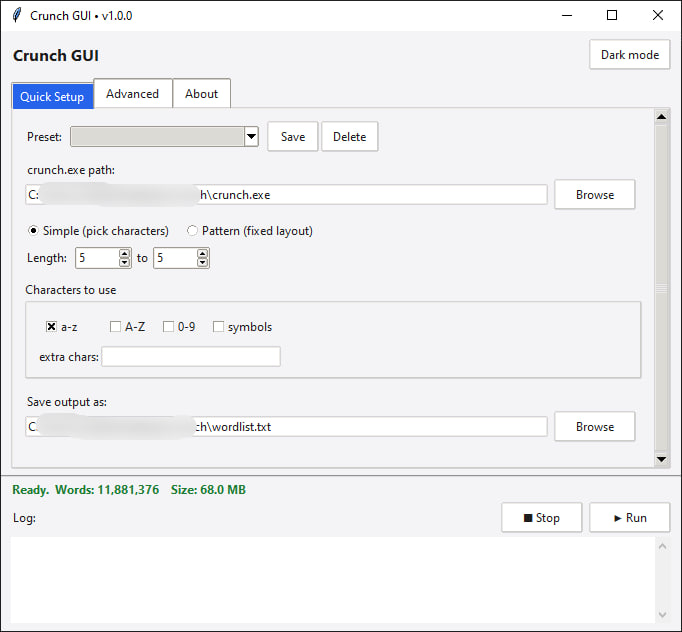

<div align="center">

# ⚡ CrunchGUI

### A Modern GUI for Crunch Password Wordlist Generator


---

A beautiful, lightweight and user-friendly graphical interface for **Crunch**, designed to generate password wordlists without remembering complex terminal commands.

**Windows • Fast • Open Source**

</div>

---

# ✨ Features

- 🎨 Modern and clean interface
- ⚡ Generate Crunch commands instantly
- 🔢 Min & Max length selection
- 🔠 Character set customization
- 📝 Pattern support
- 📂 Output file selection
- 🚀 One-click wordlist generation
- 💻 No need to memorize Crunch syntax
- 🪶 Lightweight and portable
- ❤️ Open Source

---

# 📸 Screenshots



---

# 🚀 Installation

Download the latest release from:

> **Releases →**

https://github.com/mehdirzfx/CrunchGUI/releases

or clone the repository:

```bash
git clone https://github.com/mehdirzfx/CrunchGUI.git
cd CrunchGUI
```

---

# 🛠 Requirements

- Windows 10/11
- Crunch installed (or bundled with the application)

---

# 📖 What is Crunch?

Crunch is one of the most popular password wordlist generators used by security researchers and penetration testers.

CrunchGUI makes it easier by providing an intuitive graphical interface instead of using terminal commands.

---

# 🎯 Who is it for?

- Penetration Testers
- Security Researchers
- CTF Players
- Students
- Ethical Hackers

---

# ❤️ Why CrunchGUI?

Instead of typing commands like:

```bash
crunch 8 8 abc123 -o passwords.txt
```

Simply choose your options in the GUI and press **Generate**.

No syntax.
No mistakes.
Just click and generate.

---

# 📦 Roadmap

- [x] Initial GUI
- [x] Character set selection
- [x] Output configuration
- [x] Saved presets
- [x] Dark Mode
- [x] Advanced Crunch options
- [ ] Multi-language support
- [ ] Linux Support

---

# 🤝 Contributing

Pull requests are welcome!

If you'd like to improve CrunchGUI, feel free to fork the repository and submit a PR.

---

# ⭐ Support

If you like this project, consider giving it a ⭐ on GitHub.

It really helps the project grow.

---

# 📜 License

This project is licensed under the MIT License.

---

<div align="center">

Made with ❤️ by **Mehdirzfx**

</div>
